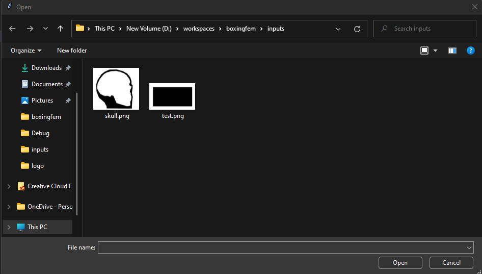
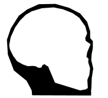
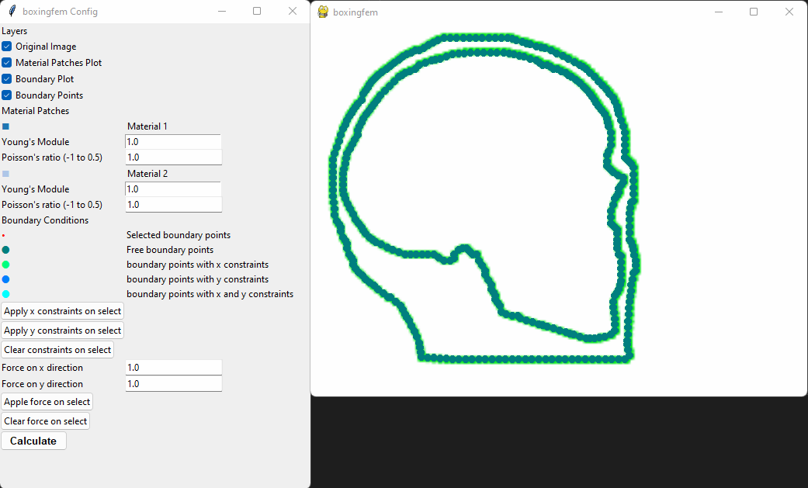
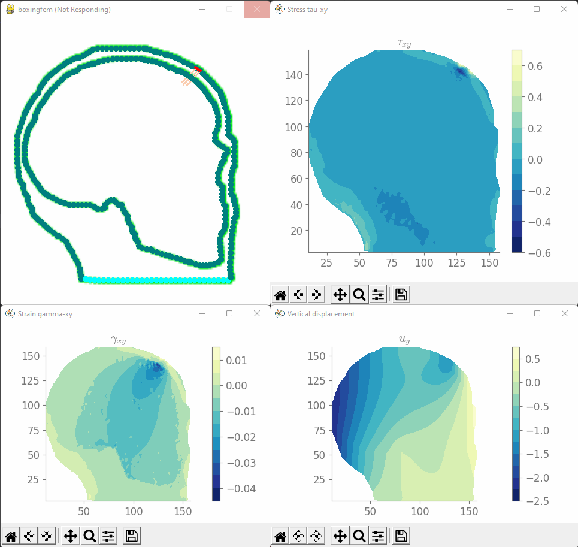

# BOXINGFEM

This is a simple 2D Finite Element Analysis (FEA) software that allows the users to give simple pictures as inputs, and a graphic user interface is provided that allows the user to specify characteristics of materials, forces and constraints of nodes. The software uses the [gmsh](https://gmsh.info/) library to make meshes from the picture inputs, and uses the [solidspy](https://pypi.org/project/solidspy/) library to do the 2D Finite Element Analysis.

## How To Install

The software is written in Python 3. Using the following commands to install dependencies:

### [pygame](https://www.pygame.org/news) - Rendering engine
```
pip install pygame
```

### [opencv](https://opencv.org/) - Preprocessing picture inputs and extracting the contoures (edges)
```
pip install opencv-python
```

### [gmsh](https://gmsh.info/) - Generating meshes from the inputs
```
pip install gmsh
```

### [meshio](https://pypi.org/project/meshio/2.3.5/) - Reading the `.msh` file generated from gmsh
```
pip install meshio
```

### [matplotlib](https://matplotlib.org/) - Plotting library
```
pip install matplotlib
```

### [pyqtree](https://pypi.org/project/Pyqtree/) - QuadTree library for user's selection inputs
```
pip install Pyqtree
```

### [solidspy](https://pypi.org/project/solidspy/) - 2D Finite Element Analysis (FEA) library
```
pip install solidspy
```

*TODO: make an installing script*

## How To Run
```
python boxingfem.py
```

### Select the Input

After running the python program, a file selection dialog will pop up. The user can select an image (`.png`, `.jpg`, etc.) file as the input.



An example of the input pictures is shown below. Different materials are represented by different high contrast areas. For example, the black area below can represent soft organic tissues, and the center white area can represent the hard skull. The software will automatically preprocessing the input picture and extract different areas and boundaries.



### User interface

After selecting the input, two windows will pop up as shown below. The first window contains different options and widgets that allows the user to apply characteristics and attributes (such as materials Young's Modulus and Poisson's ratio, forces and constrains applied to nodes, etc.) to the inputs. The second window is the preview window that allows the user to view different layers of the preprocessed inputs (such as original image, material patches plot, boundary points plot). The user can drag and select nodes on the boundary points plot and apply forces or constraints using the interface provided on the first window.



### Viewing Analysis Results

After configing the input, the user can hit the **Calculate** button to run the 2D FEA and view the results. Three groups of result plots will appear to show the output of the FEM analysis:

- Stress plots: these plots show the stresses on the analysis subject along different dimensions
- Stain plots: these plots show the magnitude of deformations on the analysis subject along different dimensions
- Displacement plots: these plots show the overall resultant displacements of each node along different dimensions



## Future Works

- Take the resultant displacements of each node and update their positions, then take the updated nodes as the new input to generate the analysis results at the next tick
- Provide a better way to present and input the forces
